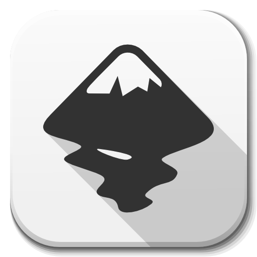

  

First of all, let me introduce myself. My name is Felipe Campinho.

- I'm passionate about a lot of things: Gadgets, technology, codes and electronic music.
- Minimalism We must find a simple way to live: Thinking to myself, developing and programming..
- Higher education in computer systems by Universidade Federal Fluminense (UFF) and
 Telecommunications technician with emphasis on developing interactive applications for Digital TV by Federal Center for Technological Education (CEFET-RJ)
- Always helping companies and friends to deliver the best API to their customers.
- Enthusiast of everything that can use Javascript with that hint of TypeScript and a lot of free software.
- (growing and learning). Let's go!

**Stack:**  

  

**Support:**  

   

**Used:**  

   

**Tools:**  

   

  
  

  

    
    
   
  

  

